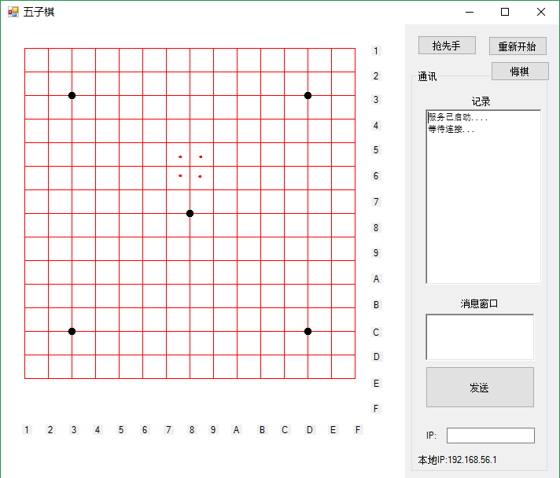
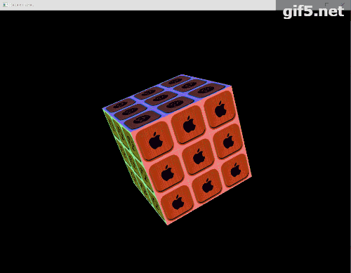

# college-legacy

大学里搞的小项目列表

A legacy list in my college life.

### chat

一个基于 Java 和 Java Swing 的，模仿 QQ 的聊天软件。

A simple QQ-like Chat.
A Desktop Chat based on Socket written with Java & Java Swing.

### farm

老师带我做的一个农场实际项目，使用 ASP 写的。

A real world project for farm written with ASP.

### gobang

一个基于 C# 的网络五子棋对战软件。

A Desktop gobang game based on socket written with C#.

### magic-cube

一个基于 OpenGL 的，使用 C++ 写的魔方游戏。

A interactive desktop magic cube based on OpenGL written with C++.

### remote-control

一个基于 Linux 单片机的 Led 控制程序，使用 C 编写。

### simple-enctype

一个用 C++ 写的，简单加密文件。当初为了不让别人看某些文件而写的。

简单粗暴地将文件中的任意位置的二进制替换掉，并记录在一个 txt 文件中，需要恢复的时候，
用 txt 文件中的修改记录就能正常恢复文件。

### work-over

一个提醒自己下班的 C# 桌面软件。

